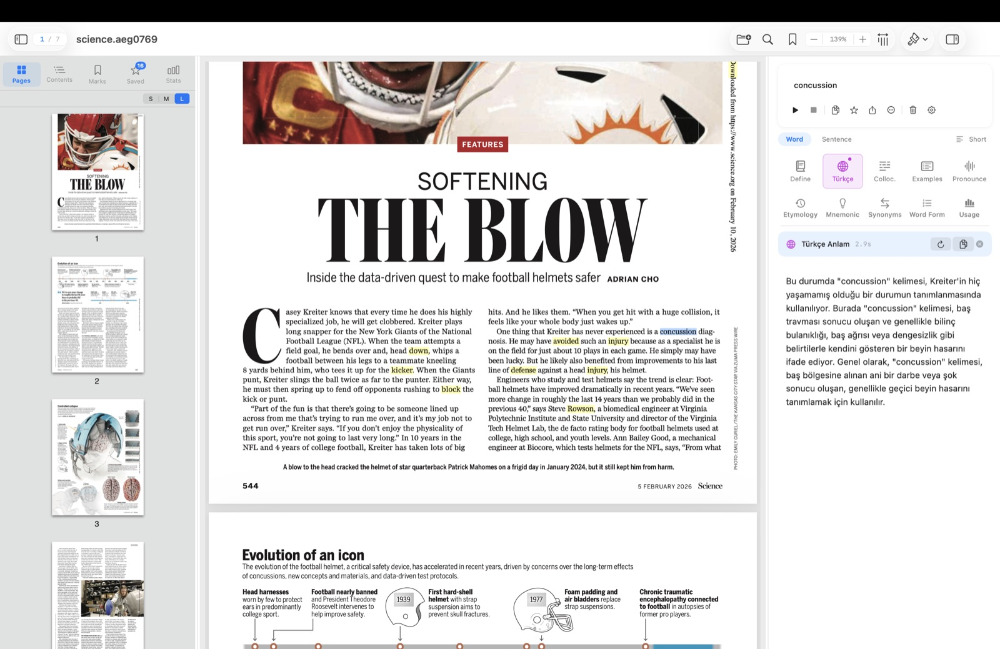
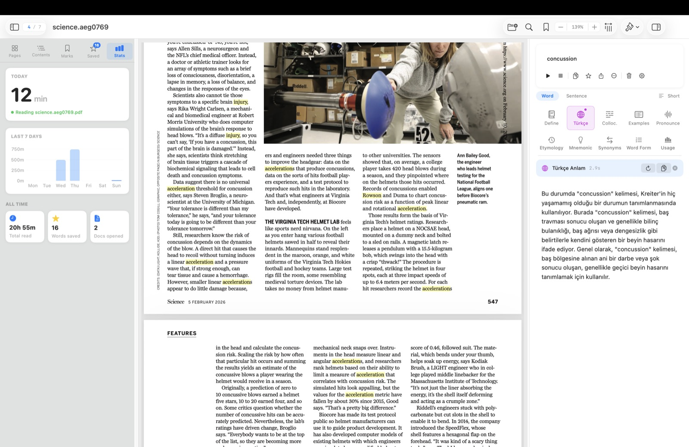
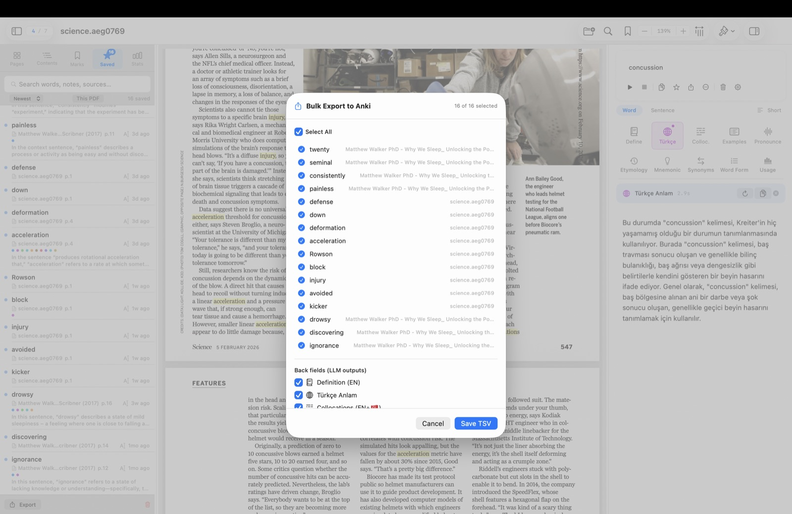

<p align="center">
  
</p>

<h1 align="center">RELL</h1>
<p align="center"><strong>Reader for Language Learner</strong></p>

<p align="center">
  A native macOS PDF reader with built-in AI-powered vocabulary analysis.<br/>
  Look up any word or sentence while reading — definitions, collocations, etymology, mnemonics, and more — powered by local or cloud LLMs.
</p>

<p align="center">
  
  
  
  
</p>

---

## Screenshots

<p align="center">
  
</p>

<p align="center">
  
</p>

<p align="center">
  
</p>

## Features

- **PDF Reader** — Full-featured viewer built on PDFKit: page navigation, search, bookmarks, zoom, reading position memory
- **10 Analysis Modules** — Definition, native-language meaning, collocations, examples, pronunciation (IPA), etymology, mnemonics, synonyms, word family, usage notes
- **Multi-LLM Support** — LM Studio, Ollama, OpenAI-compatible APIs, and Anthropic Claude
- **12 Languages** — English, Turkish, German, French, Spanish, Japanese, Korean, Chinese, Arabic, Portuguese, Russian, Italian
- **Anki Export** — Save words and export as TSV flashcards (single or bulk) with context sentences
- **Reading Stats** — Daily/weekly reading time tracking, unique documents count
- **Text-to-Speech** — Listen to selected text with system voices
- **Themes** — Light/dark/system app theme, PDF page themes (original, sepia, dark)
- **Privacy-First** — Works fully offline with local LLMs, no telemetry, no cloud dependency required

## Installation

### Download (Recommended)

1. Download the latest `.dmg` from [Releases](../../releases)
2. Open the DMG and drag **Reader for Language Learner** to Applications
3. On first launch: **Right-click > Open** (required for unsigned apps on macOS)

### Build from Source

```bash
git clone https://github.com/mkrkmz/RELL.git
cd RELL
make build
# or open in Xcode:
make open
```

> Requires Xcode 16+ and macOS 15+

## Getting Started

### 1. Set Up an LLM Backend

RELL supports four LLM backends. Pick one:

| Backend | Local | API Key | Default URL |
|---------|-------|---------|-------------|
| [LM Studio](https://lmstudio.ai/) | Yes | No | `http://127.0.0.1:1234` |
| [Ollama](https://ollama.com/) | Yes | No | `http://127.0.0.1:11434` |
| OpenAI-compatible API | No | Yes | `https://api.openai.com` |
| [Anthropic Claude](https://console.anthropic.com/) | No | Yes | `https://api.anthropic.com` |

**Quick start with LM Studio (recommended for privacy):**
1. Download [LM Studio](https://lmstudio.ai/) and install a model (e.g. `gemma-3-4b`)
2. Start the local server: **Developer > Start Server**
3. RELL connects automatically — no configuration needed

### 2. Configure in Settings

Open **Settings** (`Cmd + ,`) to:
- **General** — Set your native and target language
- **LLM** — Choose backend, server URL, model, API key
- **Appearance** — App theme and PDF page theme

### 3. Start Reading

1. **Open a PDF** — `Cmd + O` or drag-and-drop
2. **Select text** — Highlight a word or sentence in the PDF
3. **Analyze** — Click any module in the inspector panel:

| Module | Description |
|--------|-------------|
| Definition | English definition with part of speech |
| Meaning | Translation in your native language |
| Collocations | Common word combinations |
| Examples | Example sentences in context |
| Pronunciation | IPA transcription and respelling |
| Etymology | Word origin and history |
| Mnemonic | Memory aid for retention |
| Synonyms | Synonyms and antonyms |
| Word Family | Related word forms (noun, verb, adj, adv) |
| Usage Notes | Register, frequency, and common mistakes |

4. **Save & Export** — Save words to your list, export to Anki as TSV flashcards

## Keyboard Shortcuts

| Shortcut | Action |
|----------|--------|
| `Cmd + O` | Open PDF |
| `Cmd + F` | Find in PDF |
| `Cmd + B` | Toggle bookmark |
| `Cmd + L` | Focus inspector & run last module |
| `Cmd + ,` | Settings |
| `Cmd + +/-` | Zoom in/out |
| `Cmd + 0` | Fit to width |
| `Cmd + Opt + S` | Toggle sidebar |
| `Cmd + Opt + I` | Toggle inspector |

## Project Structure

```
Reader for Language Learner/
  App/            Main views (ContentView, InspectorView, SidebarView)
  Models/         Data models & state management (@Observable)
  LLM/            LLM clients, configuration, prompt templates
  Reader/         PDF components (PDFKit wrapper)
  UI/             Design system (DS namespace), result rendering
  Settings/       Settings views
  Export/         Anki TSV export
  Speech/         Text-to-speech manager
```

See [ARCHITECTURE.md](ARCHITECTURE.md) for detailed technical documentation.

## Tech Stack

| Layer | Technology |
|-------|-----------|
| Language | Swift 6.2 |
| UI | SwiftUI |
| PDF | PDFKit |
| LLM | OpenAI-compatible API + Anthropic Messages API |
| Speech | AVFoundation |
| State | `@Observable` + `@AppStorage` |
| Storage | JSON file-based (`~/Library/Application Support/RELL/`) |
| Dependencies | None — Apple system frameworks only |

## Contributing

See [CONTRIBUTING.md](CONTRIBUTING.md) for development setup, code standards, and PR guidelines.

## License

This project is licensed under the [MIT License](LICENSE).

---

<details>
<summary><strong>Turkce / Turkish</strong></summary>

## RELL - Dil Ogrencileri icin PDF Okuyucu

Yerlesik yapay zeka destekli kelime analizi sunan macOS PDF okuyucu uygulamasi.

Okurken sectiginiz kelime veya cumleleri aninda analiz eder: tanim, anlam, kolokasyon, ornek cumle, etimoloji, telaffuz, mnemonik, es anlamli, kelime ailesi ve kullanim notlari. LM Studio, Ollama, OpenAI uyumlu API'ler ve Anthropic Claude destekler.

### Ozellikler

- **PDF Okuyucu** — Sayfa navigasyonu, arama, yer imi, zoom, okuma pozisyonu hafizasi
- **10 Analiz Modulu** — Tanim, ana dilde anlam, kolokasyonlar, ornekler, telaffuz (IPA), etimoloji, mnemonik, es anlamlilar, kelime ailesi, kullanim notlari
- **Multi-LLM Destegi** — LM Studio, Ollama, OpenAI uyumlu API'ler ve Anthropic Claude
- **12 Dil** — Ingilizce, Turkce, Almanca, Fransizca, Ispanyolca, Japonca, Korece, Cince, Arapca, Portekizce, Rusca, Italyanca
- **Anki Entegrasyonu** — Kelimeleri Anki kartlarina aktar (tekli ve toplu), baglam cumleleri ile
- **Okuma Istatistikleri** — Gunluk/haftalik okuma suresi, belge sayisi takibi
- **Sesli Okuma** — Secilen metni text-to-speech ile dinleme
- **Temalar** — Acik/koyu/sistem temasi, PDF sayfa temasi (orijinal, sepya, koyu)
- **Gizlilik Oncelikli** — Yerel LLM'ler ile tamamen cevrimdisi calisir

### Kurulum

1. [Releases](../../releases) sayfasindan son `.dmg` dosyasini indirin
2. DMG'yi acin ve uygulamayi Applications klasorune surukleyin
3. Ilk acilista: **Sag tik > Ac** (imzasiz uygulama icin gerekli)

### Kaynak Koddan Derleme

```bash
git clone https://github.com/mkrkmz/RELL.git
cd RELL
make build
```

> Xcode 16+ ve macOS 15+ gerektirir

### Hizli Baslangic

1. [LM Studio](https://lmstudio.ai/) indirin, bir model yukleyin ve sunucuyu baslatin
2. RELL'i acin, bir PDF yukleyin
3. Bir kelime secin ve sag paneldeki modullerden birini tiklayin
4. Kelimeyi kaydedin, Anki'ye aktarin

### Lisans

Bu proje [MIT Lisansi](LICENSE) altinda lisanslanmistir.

</details>
