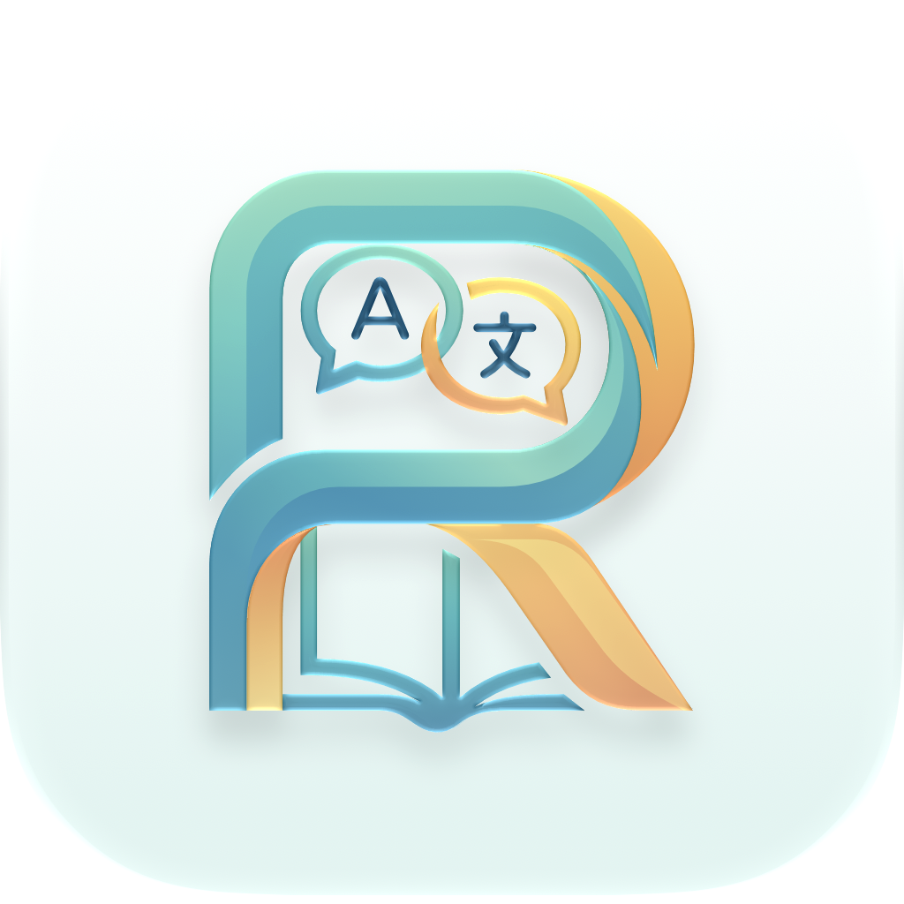
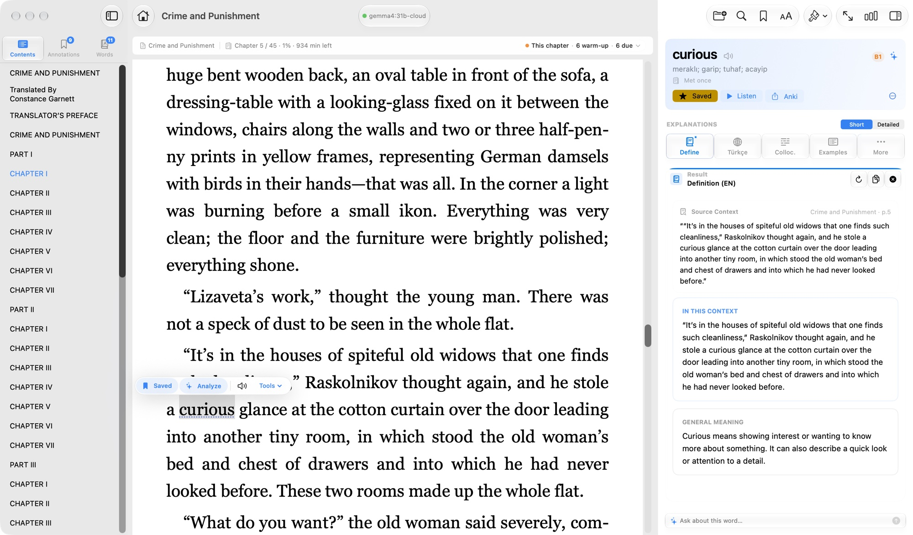
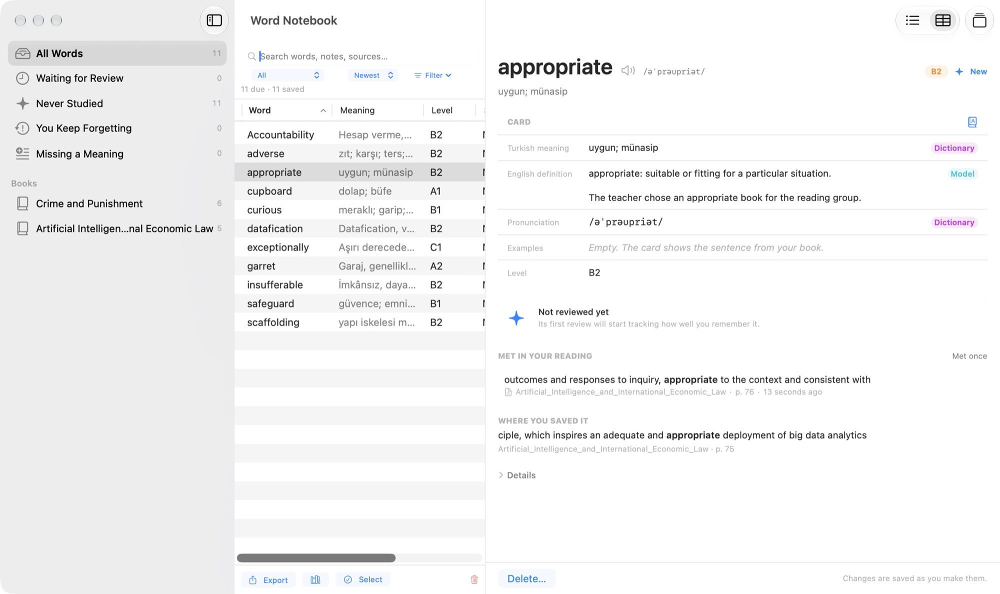
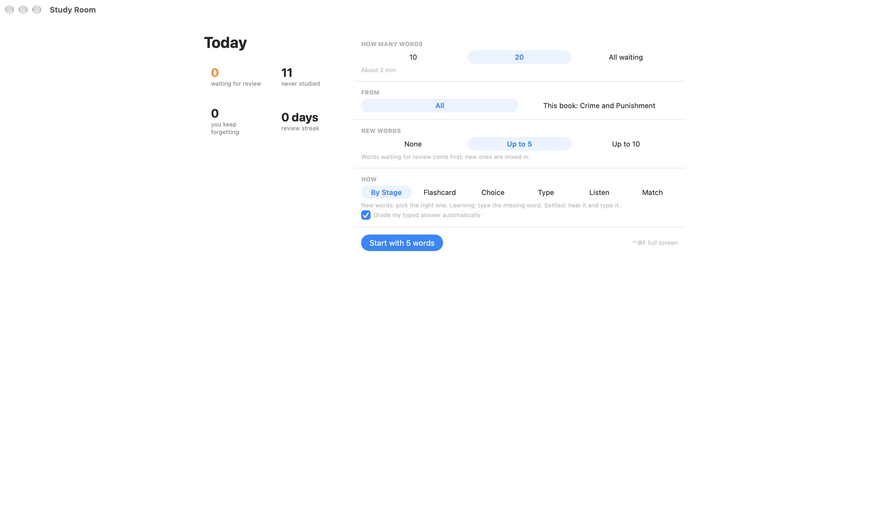
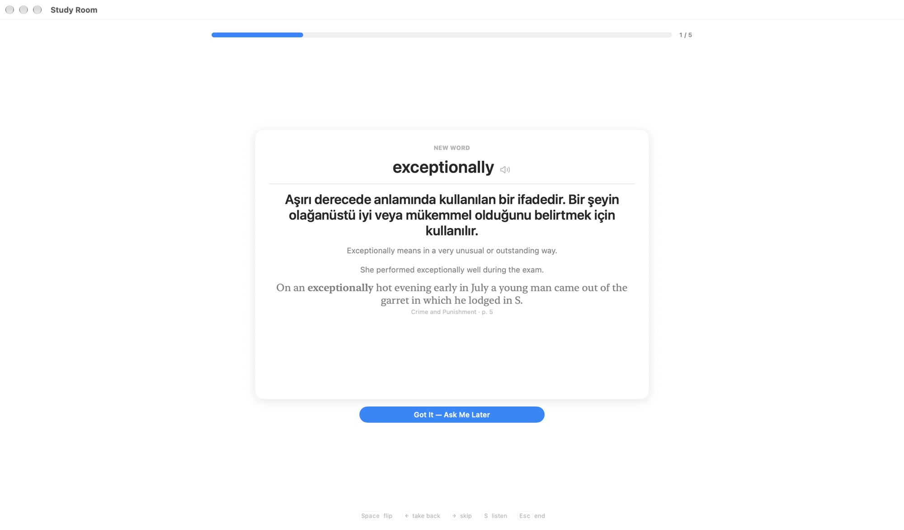
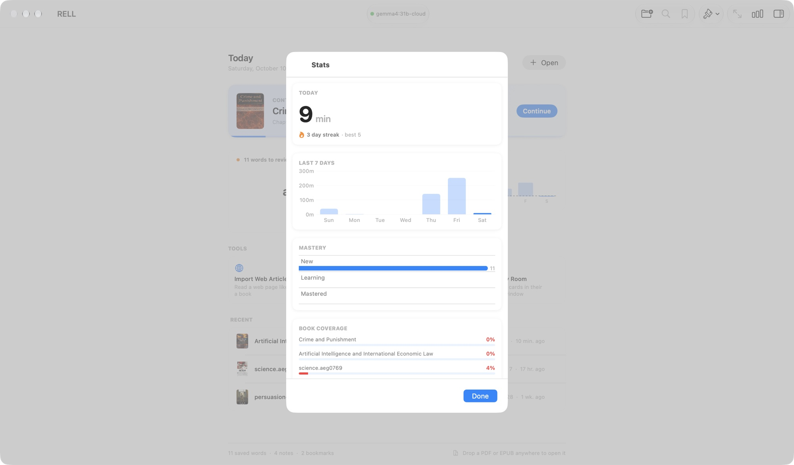

<p align="center">
  
</p>

<h1 align="center">RELL</h1>
<p align="center"><strong>Reader for Language Learner</strong></p>

<p align="center">
  A native macOS reader for PDFs and EPUBs. Select a word while you read, get its meaning
  in the sentence you met it in, and review it later in a study room.<br/>
  Works offline with a local model, or with Apple Intelligence, LM Studio, Ollama or a cloud API.
</p>

<p align="center">
  
  
  
  
</p>

<p align="center">
  
</p>

---

## Screenshots

<p align="center">
  
</p>

<p align="center">
  
</p>

<p align="center">
  
</p>

<p align="center">
  
</p>

<p align="center">
  
</p>

## Features

**Reading**
- **PDF and EPUB** — PDFKit viewer (search, bookmarks, zoom, page themes) and a dependency-free EPUB 2/3 engine (chapters, table of contents, in-book search). Both remember where you stopped.
- **Zen mode**, page themes (original, sepia, dark), and an Inspector that can follow the page's colours.
- **Import a web article** and read it like a book. **Kindle import** brings in the words you looked up on a connected Kindle.
- **Reading recap and chapter warm-up** — opening a book after a break sums up where you left off and shows the hard words of the chapter first.

**Word analysis**
- **10 analysis modules** — definition, meaning in your language, collocations, examples, pronunciation (IPA), etymology, memory hook, synonyms and antonyms, word family, usage notes.
- **Word or sentence** — one word is explained as a word, a longer selection as a sentence, with simplify and retell.
- **Fill Missing** — saved words without a meaning get one: Apple's dictionary first, then the on-device model, then your AI provider if you allow it. Nothing you wrote is replaced.

**Words and review**
- **Word notebook** (⌥⌘K) — every saved word in one window: sort by level, status or next review, grouped by book and deck. Duplicate forms ("gleam" and "gleaming") merge when you ask.
- **Study room** (⌥⌘V) — choose how many words, from where, and which exercise: flashcards, choice, typing, listening, matching, or *By Stage*, which picks the exercise to match how well you know each word.
- **New words are introduced** before they are asked. Words you keep forgetting get a memory hook.
- **Reading statistics** — daily and weekly reading time, streak, mastery and how much of each book you know.

**Export and your data**
- **Anki** — TSV, CSV or Quizlet export, single or bulk, with context sentences. A deck per book is available.
- **Daily backups** (the last seven are kept), one-click restore, and export/import of everything.

**AI providers**
- **Apple Intelligence** (macOS 26 with Apple Intelligence on) — answers the core modules on-device with nothing to install. Sentence translation works offline with Apple Translation.
- **LM Studio**, **Ollama** — local, no API key.
- **OpenAI-compatible APIs** and **Anthropic Claude** — cloud, with the API key stored in the Keychain.
- **Settings ▸ AI** lists every feature and where its text goes.

**Languages:** English, Turkish, German, French, Spanish, Japanese, Korean, Chinese, Arabic, Portuguese, Russian, Italian. The interface is in English and Turkish.

**Privacy:** no telemetry. With a local model or Apple Intelligence, RELL works fully offline.

## Installation

### Download (recommended)

1. Download the latest `.dmg` from [Releases](../../releases).
2. Open it and drag **Reader for Language Learner** into Applications.
3. On first launch use **Right-click ▸ Open**. The app is not notarized yet, so macOS asks once.

### Build from source

```bash
git clone https://github.com/mkrkmz/RELL.git
cd RELL
make build      # Debug build
make open       # open in Xcode
```

Requires Xcode 16+ and macOS 15+.

```bash
make test       # unit tests, same scope as CI
make ui-test    # launch and performance UI tests
```

## Getting started

1. **Choose an AI provider** — on macOS 26 with Apple Intelligence, nothing to set up. Otherwise install [LM Studio](https://lmstudio.ai/) (Developer ▸ Start Server; RELL connects automatically at `http://127.0.0.1:1234`) or [Ollama](https://ollama.com/).
2. **Set your languages** in Settings (`⌘,`): your language and the language you are learning.
3. **Open a book** with `⌘O` or drop a PDF or EPUB on the window.
4. **Select a word** and choose a module in the Inspector. Save it.
5. **Study** in the study room (⌥⌘V) or export to Anki.

## Keyboard shortcuts

| Shortcut | Action |
|----------|--------|
| `⌘O` | Open a PDF or EPUB |
| `⌘F` | Find in the document |
| `⌘B` | Toggle bookmark |
| `⌘L` | Focus the Inspector and run the last module |
| `⌘K` | Command palette |
| `⌥⌘K` | Word notebook |
| `⌥⌘V` | Study room |
| `⌘,` | Settings |
| `⌘+` / `⌘-` / `⌘0` | Zoom in / out / fit to width |
| `⌥⌘S` | Toggle sidebar |
| `⌥⌘I` | Toggle Inspector |

## Project structure

```
Reader for Language Learner/
  App/        Main views (ContentView, InspectorView, SidebarView, home, notebook, study room)
  Models/     State and persistence (@Observable): words, books, stats, backups
  LLM/        Providers (Apple Intelligence, LM Studio, Ollama, OpenAI-compatible, Anthropic), prompts
  Reader/     PDF/ (PDFKit) and EPUB/ (in-house ZIP and OPF engine, WKWebView)
  UI/         Design system (DS namespace) and shared components
  Settings/   Settings tabs
  Export/     Anki and other exports
  Speech/     Text-to-speech
```

See [ARCHITECTURE.md](ARCHITECTURE.md) for the technical details.

## Tech stack

| Layer | Technology |
|-------|-----------|
| Language | Swift (Swift 6.2 toolchain, Swift 5 language mode) |
| UI | SwiftUI with AppKit where needed |
| PDF | PDFKit |
| EPUB | In-house ZIP decoder + EPUB 2/3 parser, rendered in WKWebView |
| AI | Apple Intelligence, OpenAI-compatible and Anthropic APIs, LM Studio, Ollama |
| State | `@Observable` + `@AppStorage` |
| Storage | JSON files in `~/Library/Application Support/RELL/` |
| Dependencies | None — Apple system frameworks only |

## Contributing

See [CONTRIBUTING.md](CONTRIBUTING.md) for the development setup, code standards and pull request guidelines.

## License

Licensed under the [MIT License](LICENSE).

---

<details>
<summary><strong>Türkçe</strong></summary>

## RELL — Dil öğrencileri için PDF ve EPUB okuyucu

Okurken seçtiğiniz kelimenin anlamını, karşılaştığınız cümle bağlamında gösteren macOS okuyucusu. Kelimeleri sonra çalışma odasında tekrar edersiniz.

Yerel bir model, Apple Intelligence, LM Studio, Ollama veya bulut API'leriyle çalışır; yerel modellerle tamamen çevrimdışı kullanılabilir.

### Özellikler

- **PDF ve EPUB okuyucu** — arama, yer imi, yakınlaştırma ve sayfa temaları; EPUB 2/3 motoru kitap içi arama ve bölümleri destekler. İkisi de okuma konumunu hatırlar.
- **10 analiz modülü** — tanım, anadilde anlam, kolokasyonlar, örnekler, telaffuz (IPA), etimoloji, anımsatıcı, eş ve zıt anlamlılar, kelime ailesi, kullanım notları.
- **Kelime defteri (⌥⌘K)** — tüm kayıtlı kelimeler tek pencerede; seviyeye, duruma ya da sonraki tekrara göre sıralama. Aynı kelimenin farklı biçimleri birleştirilebilir.
- **Çalışma odası (⌥⌘V)** — kart, seçme, yazma, dinleme, eşleştirme ve kelimeyi bildiğinize göre egzersiz seçen *By Stage* modu.
- **Fill Missing** — anlamı olmayan kayıtlara önce Apple sözlüğünden, sonra yerel modelden, izin verirseniz sağlayıcınızdan anlam eklenir.
- **Kindle içe aktarma**, **web makalesi içe aktarma**, **okuma istatistikleri** ve **günlük yedekler**.
- **Anki** — TSV, CSV veya Quizlet olarak, tekli ya da toplu; kitap başına deste seçeneğiyle.
- **AI sağlayıcıları** — Apple Intelligence, LM Studio, Ollama, OpenAI uyumlu API'ler ve Anthropic Claude.
- **12 dil**, arayüz İngilizce ve Türkçe. Telemetri yok.

### Kurulum

1. [Releases](../../releases) sayfasından son `.dmg` dosyasını indirin.
2. Uygulamayı Applications klasörüne sürükleyin.
3. İlk açılışta **Sağ tık ▸ Aç** yapın (uygulama henüz notarize edilmedi).

### Kaynak koddan derleme

```bash
git clone https://github.com/mkrkmz/RELL.git
cd RELL
make build
```

> Xcode 16+ ve macOS 15+ gerektirir.

### Hızlı başlangıç

1. Apple Intelligence yoksa [LM Studio](https://lmstudio.ai/) kurun, bir model yükleyin ve sunucuyu başlatın.
2. RELL'de bir PDF veya EPUB açın.
3. Bir kelime seçin ve Inspector'daki modüllerden birini çalıştırın.
4. Kelimeyi kaydedin; çalışma odasında tekrar edin veya Anki'ye aktarın.

### Lisans

[MIT Lisansı](LICENSE) altında lisanslanmıştır.

</details>
